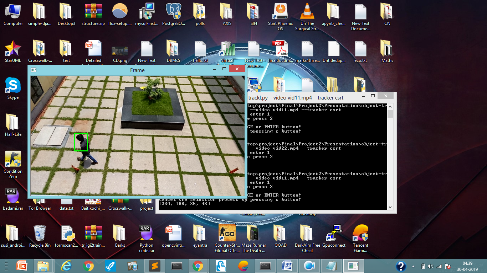

# Tracking-same-person-in-two-differnt-videos
Here I would be using OpenCv's tracking algorithms and template matching to acheive this objective 
Requirements-  
Python 3.6 with following libraries -  
1. Imutils 
2. time  
3. cv2 
4. Pillow 
5. Numpy 
6. Pyzbar 
For running the trackl.py type the following command -  
python trackl.py --video vid11.mp4 --tracker csrt  
python trackl.py --video vid22.mp4 --tracker csrt  
Youtube video -  
https://www.youtube.com/watch?v=_5Rnba2UubQ&feature=youtu.be

